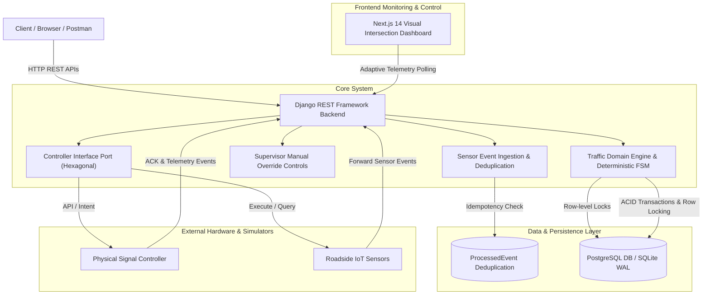
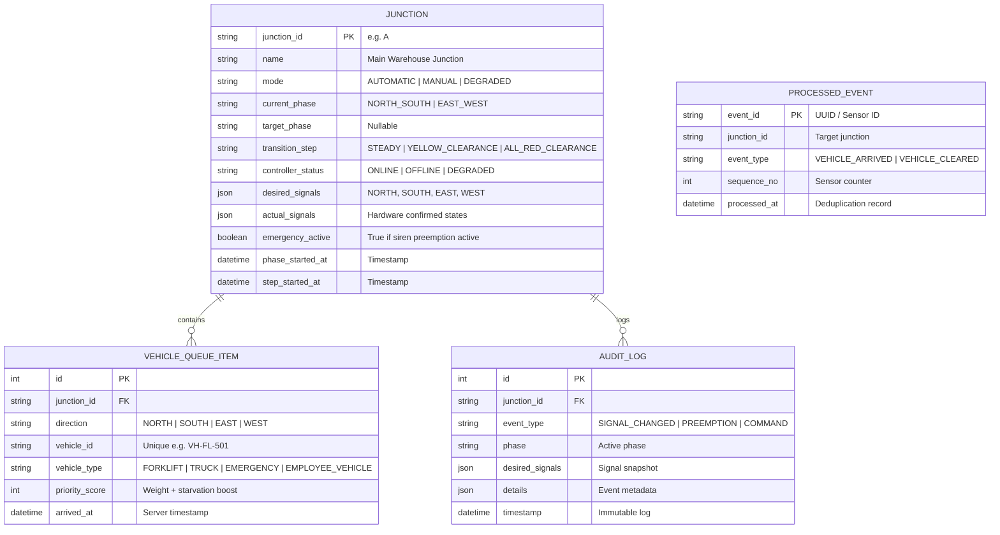

# Factory Traffic Management System (FTMS) 🚦🏭

> **CSI Smart Tech Ltd — Backend Developer Intern Technical Assessment**  
> **Candidate:** Arka Karmoker ([GitHub](https://github.com/ArkaKarmoker) • [LinkedIn](https://linkedin.com/in/arkakarmoker))  
> **Repository:** `factory-traffic-management-system`

---

## 📌 Executive Summary

The **Factory Traffic Management System (FTMS)** is a safety-critical, event-driven traffic control engine for a garment manufacturing plant. It coordinates 4-way intersection signals (Junction A: `NORTH`, `SOUTH`, `EAST`, `WEST`) serving forklifts, delivery trucks, employee transports, and emergency responders.

The system is built on **Hexagonal / Clean Architecture** with pure Python domain logic completely decoupled from HTTP, databases, and UI.

---

## 🏛️ System Architecture



---

## 📊 Database Schema (ERD)



---

## 🚦 Traffic Control Logic & State Machine

Non-conflicting traffic phases:
* **Phase 1 (`NORTH_SOUTH`):** `NORTH` & `SOUTH` are GREEN; `EAST` & `WEST` are RED.
* **Phase 2 (`EAST_WEST`):** `EAST` & `WEST` are GREEN; `NORTH` & `SOUTH` are RED.

### Strict Safety Invariants
1. **Zero Conflicting Green:** Opposing directions are mathematically prevented from being green simultaneously.
2. **Deterministic Clearance Sequence:** A green phase cannot switch directly to another phase without clearance:
   ```text
   ACTIVE GREEN (30s) -> YELLOW (5s) -> ALL-RED (2s) -> NEXT GREEN (30s)
   ```
3. **Emergency Preemption:** Emergency vehicles immediately trigger clearance (`YELLOW -> ALL-RED -> EMERGENCY GREEN`).
4. **Physical Telemetry Separation:** Backend tracks `desired_signals` separately from `actual_signals` confirmed by hardware.

---

## ⏱️ Priority Scheduling Algorithm

Phase selection evaluates a composite score for each waiting direction:

```text
Direction Score = Sum of [ Vehicle Weight + (Wait Time in seconds * 0.8) + Starvation Bonus ]
```

### Vehicle Weights
* **EMERGENCY:** `1000.0` (Dominates scheduling, initiates immediate preemption)
* **TRUCK:** `25.0` (High priority raw material delivery)
* **FORKLIFT:** `15.0` (Shop-floor production logistics)
* **EMPLOYEE_VEHICLE:** `5.0` (General transit)

### Anti-Starvation Protection
If any vehicle waits longer than **45 seconds**, an automatic **+80.0 score boost** is added, preventing lower-priority vehicles from being permanently blocked.

---

## 🛠️ Installation & Quick Start

### Option A: One-Command Docker Setup (Recommended)

Requires Docker Desktop installed.

```bash
# Clone repository
git clone https://github.com/ArkaKarmoker/factory-traffic-management-system.git
cd factory-traffic-management-system

# Build and start all services (PostgreSQL, Backend, Frontend)
docker compose up --build
```
* **Frontend Dashboard:** [http://localhost:3000](http://localhost:3000)
* **Backend API & Swagger Docs:** [http://localhost:8000/api/docs/](http://localhost:8000/api/docs/)
* **Admin Token:** `factory-admin-token-2026`

---

### Option B: Local Development Setup

#### 1. Backend Setup (Python 3.12)
```bash
cd backend

# Create & activate virtual environment
python -m venv venv
.\venv\Scripts\activate       # Windows PowerShell
# source venv/bin/activate    # Linux / macOS

# Install dependencies
pip install -r requirements.txt

# Run migrations & seed Junction A
python manage.py migrate
python manage.py seed_junction

# Start Django server
python manage.py runserver 127.0.0.1:8000
```

#### 2. Frontend Setup (Next.js 14)
Open a new terminal:
```bash
cd frontend

# Install dependencies
npm install

# Start Next.js dev server
npm run dev
```
Open [http://localhost:3000](http://localhost:3000) in your browser.

---

## 📡 API Endpoints & Postman Collection

Interactive Swagger documentation is available at `http://localhost:8000/api/docs/`.  
A verified Postman collection is located at [`postman_collection.json`](postman_collection.json) (19 requests across 5 folders ready to import).

| Method | Endpoint | Description |
| :--- | :--- | :--- |
| `GET` | `/api/junctions` | List all registered junctions |
| `GET` | `/api/junctions/:id` | Junction configuration and details |
| `GET` | `/api/junctions/:id/status` | Live operational telemetry, desired vs actual signals, queues |
| `POST` | `/api/sensor-events` | Ingest vehicle arrivals / departures (Idempotent) |
| `POST` | `/api/junctions/:id/commands` | Supervisor manual override (`X-Admin-Token`) |
| `POST` | `/api/controller-events` | Hardware controller ACK & status telemetry |
| `GET` | `/api/junctions/:id/history` | Immutable audit trail and event logs |
| `GET` | `/api/junctions/:id/queues` | Waiting vehicle queue details |
| `POST` | `/api/junctions/:id/tick` | Advance transition timer by 1 step (Simulation helper) |
| `POST` | `/api/junctions/:id/reset` | Reset junction state and clear queues |

---

## 🧪 Automated Test Suite (24/24 Passing)

Run test suite via `pytest`:
```bash
cd backend
.\venv\Scripts\pytest -q
```
*Output: `24 passed in 0.76s (100%)`*

* **`test_domain_engine.py` (5 Tests):** Safety invariant verification, non-conflicting phases, state machine transitions, anti-starvation formula.
* **`test_api_endpoints.py` (6 Tests):** Idempotency deduplication, duplicate vehicle filtering, queue non-negativity guard, manual override.
* **`test_section15_scenarios.py` (13 Tests):** All Section 15 scenarios including normal traffic, emergency preemption, hardware failure fallback, restart recovery, and millisecond-level concurrent event race conditions.

---

## 🎮 Demonstrating Evaluation Scenarios

The Next.js dashboard includes an **Evaluator Simulator Panel**:
1. **Normal & Priority Traffic:** Select `EAST`, choose `TRUCK`, click **Simulate Arrival**. Observe queue growth and scheduling priority.
2. **Emergency Preemption:** Click the *Emergency Siren* tab, click **Ambulance on EAST**. Observe immediate transition (`YELLOW -> ALL-RED -> EAST GREEN`).
3. **Manual Override:** Under *Supervisor Manual Override*, click **Green WEST**. The system safely transitions and holds WEST green until **Return to AUTOMATIC Engine** is clicked.
4. **Idempotency & Duplicate Guard:** Click **Test Idempotency (Resend)**. Notice that duplicate `event_id` and active `vehicle_id` submissions do not duplicate queue counts.
5. **Controller Failure:** Under *Controller Hardware*, click **Simulate Controller OFFLINE**. The junction enters **DEGRADED** mode with desired **ALL-RED** and displays a **State Mismatch Warning**.

---

## Assumptions / Questions / Requirement Issues

1. **Authoritative Timestamps:** Sensor timestamps are logged for auditing, but server transaction time (`processed_at`) is authoritative for FIFO ordering and transitions.
2. **Duplicate Event Idempotency:** The `ProcessedEvent` table tracks `event_id`. Duplicate arrivals return HTTP 200 `DUPLICATE_IGNORED` without altering queue counts.
3. **Empty Queue Departures:** A `VEHICLE_CLEARED` event for an unregistered vehicle or empty queue is safely acknowledged without letting counts drop below 0.
4. **Conflicting Emergency Vehicles:** The first arriving emergency holds priority; opposing emergencies are queued with maximum score ($1000+$) and served immediately once the first departs.
5. **Manual Override Duration:** Manual mode stays active until an authorized operator issues `RETURN_TO_AUTOMATIC` or a life-safety emergency preempts it.
6. **Controller Offline Behavior:** When a controller disconnects, the backend requests desired **ALL-RED** for safety, but refuses to fabricate physical confirmation (`actual_signals` remain unconfirmed until reconnected).
7. **Restart Recovery:** If the server restarts during a signal transition, it resets to a safe clearance state rather than assuming previous physical states.
8. **Duplicate Vehicle ID in Queue:** Vehicles with an active identifier (e.g. `VH-FL-501`) already waiting cannot re-enter until cleared, preventing phantom queue inflation.

---

## AI / Tool Usage

* **Tools Used:** Antigravity AI Pair-Programming Assistant (Google Gemini 3.8 Flash).
* **Usage Scope:**
  - Scaffolding Django REST Framework views, serializers, and OpenAPI schemas.
  - Designing Next.js frontend UI components and TypeScript interfaces.
  - Generating test fixtures and edge-case unit test scenarios.
* **Engineering Accountability:** All architectural choices, safety invariants, state machine transitions, concurrency locks, and requirement issue decisions were designed, reviewed, and validated for technical correctness. The author is fully prepared to explain, debug, and modify any component during technical review.
