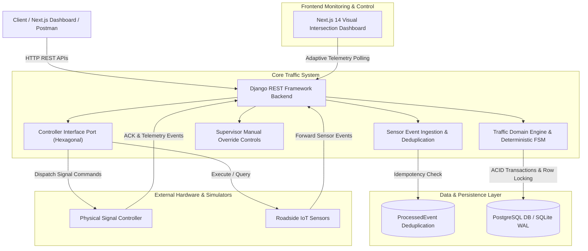
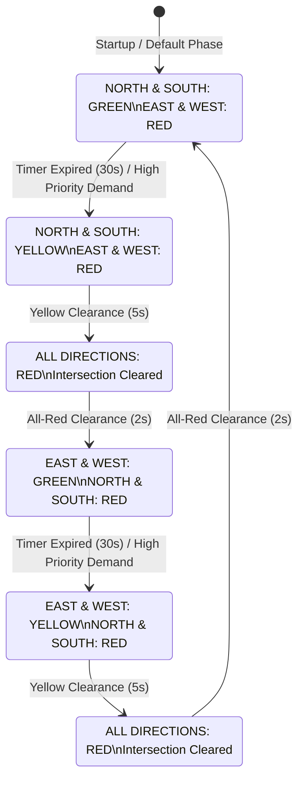
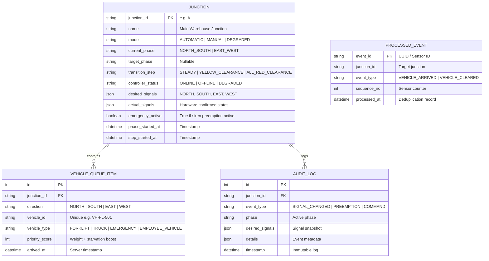

# Factory Traffic Management System (FTMS) 🚦🏭

<p align="center">
  
  
  
  
  
  
  
  
  
  
  
  
</p>

An event-driven, safety-critical traffic control system designed for internal roadways within a garment manufacturing facility. Built with a decoupled pure Python state machine engine, Django REST Framework, PostgreSQL/SQLite, and an interactive Next.js 14 real-time dashboard.

📁 **GitHub Repository:** [factory-traffic-management-system](https://github.com/ArkaKarmoker/factory-traffic-management-system)  
👨‍💻 **Developed by:** [Arka Karmoker](https://github.com/ArkaKarmoker) • [LinkedIn](https://linkedin.com/in/arkakarmoker)  
📧 **Email:** [arkakarmoker1234@gmail.com](mailto:arkakarmoker1234@gmail.com)  
🌐 **Live Frontend Dashboard (Vercel):** [https://ftms-csi.vercel.app](https://ftms-csi.vercel.app)  
🚀 **Live Backend API (Render):** [https://factory-traffic-management-system.onrender.com/api/junctions](https://factory-traffic-management-system.onrender.com/api/junctions)  
🩺 **Live Health Probe:** [https://factory-traffic-management-system.onrender.com/api/health](https://factory-traffic-management-system.onrender.com/api/health)  
📑 **Postman Collection:** [`postman_collection.json`](./postman_collection.json)  
📖 **Interactive API Docs (Swagger):** [https://factory-traffic-management-system.onrender.com/api/docs/](https://factory-traffic-management-system.onrender.com/api/docs/)

> [!NOTE]
> **CSI Smart Tech Technical Assessment Submission:** This project implements the complete **Factory Traffic Management System (Assessment V2)** specification with zero conflicting greens, deterministic clearance sequences (`GREEN -> YELLOW -> ALL-RED -> GREEN`), priority scheduling with anti-starvation, row-level concurrency locking (`select_for_update`), 24/24 automated pytest tests, Docker Compose orchestration, and 24/7 cloud deployment.

---

## 📑 Table of Contents

- [System Overview](#-system-overview)
- [Technology Stack](#-technology-stack)
- [Key Features](#-key-features)
- [Project Directory Structure](#-project-directory-structure)
- [System Architecture & Flow Diagrams](#-system-architecture--flow-diagrams)
- [Database Schema (ERD)](#-database-schema-erd)
- [Traffic Domain Logic & State Machine](#-traffic-domain-logic--state-machine)
- [Priority Scheduling & Anti-Starvation Engine](#-priority-scheduling--anti-starvation-engine)
- [Local Setup & Installation Guide](#-local-setup--installation-guide)
- [Live Cloud Deployment (Render & Vercel)](#-live-cloud-deployment-render--vercel)
- [API Endpoints Reference](#-api-endpoints-reference)
- [Postman Collection](#-postman-collection)
- [Comprehensive Automated Testing](#-comprehensive-automated-testing)
- [Demonstrating Evaluation Scenarios](#-demonstrating-evaluation-scenarios)
- [Assumptions / Questions / Requirement Issues](#assumptions--questions--requirement-issues)
- [Major Architectural Decisions & Trade-offs](#-major-architectural-decisions--trade-offs)
- [AI / Tool Usage](#ai--tool-usage)

---

## 📌 System Overview

The **Factory Traffic Management System (FTMS)** is an event-driven, safety-critical control engine designed for internal roadways within a busy garment manufacturing plant. It governs intersection signals (Junction A: `NORTH`, `SOUTH`, `EAST`, `WEST`) serving forklifts, delivery trucks, employee transports, and emergency responders.

Unlike a generic CRUD app, FTMS operates as a **deterministic discrete-event state machine**:
* **Zero Conflicting Greens:** Opposing directions are mathematically guarded against simultaneous green lights.
* **Deterministic Clearance:** Enforces a mandatory `ACTIVE GREEN (30s) -> YELLOW (5s) -> ALL-RED (2s) -> NEXT GREEN (30s)` sequence.
* **Preemption & Starvation Protection:** High-priority vehicles (Ambulance: 1000, Truck: 25, Forklift: 15) take precedence, while vehicles waiting >45s receive an anti-starvation score boost (+80).
* **Decoupled Telemetry:** Separates desired commands from controller-confirmed physical states (`desired_signals` vs `actual_signals`).
* **Clean Architecture:** Built on pure Python domain logic (`traffic_engine/`) decoupled from HTTP, database, and UI.

---

## 🛠️ Technology Stack

| Layer / Category | Technology | Details / Purpose |
| :--- | :--- | :--- |
| **Backend Framework** | Python 3.12 / Django 6.1 | REST API framework, ORM, transaction management |
| **API Architecture** | Django REST Framework 3.18 | Serializers, validation, and RESTful endpoints |
| **Domain Logic** | Pure Python Standard Library | Decoupled state machine, FSM, and priority scheduler (zero framework lock-in) |
| **Frontend Framework**| Next.js 14.2 (App Router) | Interactive real-time dashboard, SSR, and client state management |
| **Language & Typing** | TypeScript 5.7 | Strict end-to-end type safety |
| **Styling & Icons** | Tailwind CSS 3.4 / Lucide React | Modern industrial dashboard UI, dark aesthetic, responsive layout |
| **Database** | PostgreSQL 16 / SQLite 3 | PostgreSQL in Docker; SQLite with WAL mode on Render/Local |
| **API Documentation** | drf-spectacular (OpenAPI 3.0 / Swagger) | Auto-generated OpenAPI schema and Swagger UI at `/api/docs/` |
| **Testing** | Pytest 8.x / pytest-django | 24 automated tests covering safety invariants, APIs, and edge cases |
| **Containerization** | Docker / Docker Compose | Multi-container orchestration (DB + Backend + Frontend) |
| **Cloud Hosting** | Vercel (Frontend) / Render (Backend) | Globally distributed Next.js edge and Gunicorn WSGI web service |
| **Monitoring** | UptimeRobot | 24/7 automated keep-alive pinging `/api/health` every 5 minutes |

---

## 🌟 Key Features

1. **Deterministic State Machine & Safety Guards:**
   * Prevents conflicting green phases mathematically.
   * Mandates clearance phases before entering any new green state.
   * Raises `SafetyInvariantViolation` if any unsafe state is requested.

2. **Smart Priority Scheduling & Anti-Starvation:**
   * Weights traffic based on operational importance (Ambulance: 1000, Truck: 25, Forklift: 15, Employee Car: 5).
   * Automatically adds +80.0 score boost to vehicles waiting longer than 45 seconds to prevent traffic starvation.

3. **High-Concurrency Protection & Idempotency:**
   * Database row-level locking (`select_for_update()`) serializes simultaneous sensor events and commands.
   * Dedicated `ProcessedEvent` table eliminates duplicate events without duplicating queue records.
   * Duplicate vehicle IDs already in queue are blocked (`DUPLICATE_VEHICLE_IGNORED`).

4. **Hardware Telemetry Decoupling & Degradation Failsafe:**
   * Decouples `desired_signals` from `actual_signals` confirmed by hardware.
   * Detects hardware disconnection, switches to `DEGRADED` mode, commands all-red, and displays visual mismatch alerts.

5. **Real-Time Interactive Next.js Dashboard:**
   * Visual 4-way intersection layout with live signal lights.
   * Side-by-side comparison of desired vs actual hardware signals.
   * Evaluator simulator panel with vehicle arrivals, siren preemption, hardware failure toggles, and manual override.
   * Real-time audit trail feed.

---

## 📂 Project Directory Structure

```text
factory-traffic-management-system/
│
├── backend/                              # Django REST Framework Backend
│   ├── core/                             # Project Configuration
│   │   ├── settings.py                   # App config, DB router, SQLite WAL & CORS
│   │   ├── urls.py                       # Root URL routes & Swagger/OpenAPI docs
│   │   ├── wsgi.py                       # WSGI entrypoint with auto-migration hook
│   │   └── asgi.py                       # ASGI configuration
│   │
│   ├── junctions/                        # Junction API & Persistence App
│   │   ├── models.py                     # Junction, VehicleQueueItem, ProcessedEvent, AuditLog
│   │   ├── serializers.py                # DRF serializers with strict validation
│   │   ├── views.py                      # REST API endpoints (/sensor-events, /status, /commands)
│   │   ├── urls.py                       # Junction route mapping & /api/health probe
│   │   ├── services.py                   # Application service orchestrating domain & DB
│   │   ├── background_worker.py          # Background daemon thread advancing signal transitions
│   │   └── management/commands/
│   │       └── seed_junction.py          # Default seed data (Junction A & test queues)
│   │
│   ├── traffic_engine/                   # Core Domain Logic (Pure Python 3.12 - Zero Framework Coupling)
│   │   ├── enums.py                      # Direction, TrafficPhase, SignalState, JunctionMode
│   │   ├── models.py                     # Domain DTOs (SignalPlan, VehicleItem, JunctionState)
│   │   ├── state_machine.py              # Deterministic FSM & Safety Invariant Guard
│   │   ├── scheduler.py                  # Priority scoring algorithm & starvation prevention
│   │   └── controller_port.py            # Hexagonal abstract port for hardware/MQTT adapters
│   │
│   ├── tests/                            # Automated Pytest Test Suite (24/24 Passing)
│   │   ├── test_domain_engine.py         # Pure Python unit tests for state machine & invariants
│   │   ├── test_api_endpoints.py         # REST API integration tests & idempotency checks
│   │   └── test_section15_scenarios.py   # Complete Section 15 evaluation scenario tests
│   │
│   ├── Dockerfile                        # Multi-stage production container with Gunicorn
│   ├── build.sh                          # Render cloud build script (migrate, seed, collectstatic)
│   ├── requirements.txt                  # Pinned Python dependencies
│   ├── manage.py                         # Django management CLI
│   └── pytest.ini                        # Pytest configuration
│
├── frontend/                             # Next.js 14 Interactive Dashboard (App Router)
│   ├── src/
│   │   ├── app/
│   │   │   ├── layout.tsx                # Global layout with fonts and metadata
│   │   │   ├── page.tsx                  # Dashboard page with adaptive live polling (1s)
│   │   │   └── globals.css               # Tailwind CSS custom styles & animations
│   │   ├── components/
│   │   │   ├── Header.tsx                # Status indicator, live sync toggle, and refresh
│   │   │   ├── IntersectionVisualizer.tsx# Visual 4-way intersection showing live signal lights
│   │   │   ├── SignalComparisonCard.tsx  # Desired vs Actual hardware signal telemetry verification
│   │   │   ├── SimulatorPanel.tsx        # Evaluator testbed (arrivals, siren, hardware failures)
│   │   │   ├── ManualControls.tsx        # Supervisor manual override panel (X-Admin-Token)
│   │   │   ├── AuditLogFeed.tsx          # Real-time audit history & event log viewer
│   │   │   ├── Footer.tsx                # Clean industrial footer with creator attribution
│   │   │   └── ui/                       # Radix UI + Tailwind reusable components
│   │   └── lib/
│   │       ├── api.ts                    # Type-safe API client connecting to backend
│   │       └── utils.ts                  # Classname merging utilities
│   │
│   ├── Dockerfile                        # Next.js standalone runner container
│   ├── package.json                      # Frontend scripts & dependencies
│   ├── tailwind.config.js                # Tailwind theme configuration
│   └── tsconfig.json                     # TypeScript strict configuration
│
├── docker-compose.yml                    # Multi-container orchestration (PostgreSQL + Backend + Frontend)
├── postman_collection.json               # 100% verified Postman Collection (19 endpoints in 5 folders)
├── .env.example                          # Root environment template
└── README.md                             # Comprehensive project documentation
```

---

## 🏛️ System Architecture & Flow Diagrams

### 1. Hexagonal System Architecture

The core domain engine (`traffic_engine/`) is decoupled from transport, database, and hardware layers through explicit ports and adapters:



### 2. Deterministic State Machine Clearance Sequence

A green signal cannot switch directly to a conflicting phase. The state machine strictly enforces clearance transitions:



---

## 📊 Database Schema (ERD)



---

## 🚦 Traffic Domain Logic & State Machine

Non-conflicting traffic phases:
* **Phase 1 (`NORTH_SOUTH`):** `NORTH` & `SOUTH` are GREEN; `EAST` & `WEST` are RED.
* **Phase 2 (`EAST_WEST`):** `EAST` & `WEST` are GREEN; `NORTH` & `SOUTH` are RED.

### Strict Safety Invariants
1. **Zero Conflicting Green:** Opposing directions are mathematically prevented from being green simultaneously. If violated, a `SafetyInvariantViolation` runtime error is raised.
2. **Deterministic Clearance Sequence:** A green phase cannot switch directly to another phase without clearance:
   ```text
   ACTIVE GREEN (30s) -> YELLOW (5s) -> ALL-RED (2s) -> NEXT GREEN (30s)
   ```
3. **Emergency Preemption:** Emergency vehicles immediately trigger clearance (`YELLOW -> ALL-RED -> EMERGENCY GREEN`).
4. **Physical Telemetry Separation:** Backend tracks `desired_signals` separately from `actual_signals` confirmed by hardware. If the controller disconnects, unconfirmed signals remain unverified.

---

## ⏱️ Priority Scheduling & Anti-Starvation Engine

Phase selection evaluates a composite score for each waiting direction:

```text
Direction Score = Sum of [ Vehicle Weight + (Wait Time in seconds * 0.8) + Starvation Bonus ]
```

### Vehicle Weights
* **EMERGENCY:** `1000.0` (Dominates scheduling, initiates immediate preemption)
* **TRUCK:** `25.0` (High priority raw material delivery)
* **FORKLIFT:** `15.0` (Shop-floor production logistics)
* **EMPLOYEE_VEHICLE:** `5.0` (General transit)

### Anti-Starvation Protection
If any vehicle waits longer than **45 seconds** in queue, an automatic **+80.0 score boost** is added, preventing lower-priority vehicles from being permanently blocked by heavier traffic.

---

## 🛠️ Local Setup & Installation Guide

### Option A: One-Command Docker Setup (Recommended)

Requires Docker Desktop installed and running.

```bash
# 1. Clone repository
git clone https://github.com/ArkaKarmoker/factory-traffic-management-system.git
cd factory-traffic-management-system

# 2. Build and start all services (PostgreSQL, Backend, Frontend)
docker compose up --build
```
* **Frontend Dashboard:** [http://localhost:3000](http://localhost:3000)
* **Backend API & Swagger Docs:** [http://localhost:8000/api/docs/](http://localhost:8000/api/docs/)
* **Admin Token:** `factory-admin-token-2026`

---

### Option B: Local Development Setup

#### 1. Backend Setup (Python 3.12)
```bash
cd backend

# Create & activate virtual environment
python -m venv venv
.\venv\Scripts\activate       # Windows PowerShell
# source venv/bin/activate    # Linux / macOS

# Install dependencies
pip install -r requirements.txt

# Run migrations & seed Junction A
python manage.py migrate
python manage.py seed_junction

# Start Django development server
python manage.py runserver 127.0.0.1:8000
```

#### 2. Frontend Setup (Next.js 14)
Open a second terminal:
```bash
cd frontend

# Install node dependencies
npm install

# Start Next.js development server
npm run dev
```
Open [http://localhost:3000](http://localhost:3000) in your browser.

---

## 🌐 Live Cloud Deployment (Render & Vercel)

The system is deployed and publicly accessible in production:

* **Frontend Dashboard (Vercel):** [https://ftms-csi.vercel.app](https://ftms-csi.vercel.app)
* **Backend API (Render):** [https://factory-traffic-management-system.onrender.com](https://factory-traffic-management-system.onrender.com)
* **Live Health Check Probe:** [https://factory-traffic-management-system.onrender.com/api/health](https://factory-traffic-management-system.onrender.com/api/health)

### Deployment Architecture
* **Frontend on Vercel:** Next.js 14 App Router, static assets served via global edge CDN, environment variable `NEXT_PUBLIC_API_URL` pointing to Render.
* **Backend on Render:** Python 3.12 Web Service powered by Gunicorn with auto-migration and startup data seeding (`core.wsgi:application`). Runs with SQLite 3 (WAL mode) on cloud, while local Docker Compose uses PostgreSQL 16.
* **24/7 Keep-Alive Monitoring:** Configured via UptimeRobot pinging `/api/health` every 5 minutes to prevent free-tier container sleep.

---

## 📡 API Endpoints Reference

Interactive Swagger documentation is available at `/api/docs/`.

### Minimum Backend APIs (Section 10 Compliance)

| Method | Endpoint | Description |
| :--- | :--- | :--- |
| `GET` | `/api/health` | Lightweight keep-alive probe for UptimeRobot / Cloud monitoring |
| `GET` | `/api/junctions` | List all registered junctions in the facility (Section 10.1) |
| `GET` | `/api/junctions/:id` | Junction configuration and model representation |
| `GET` | `/api/junctions/:id/status` | Live operational telemetry, desired vs actual signals, queues (Section 10.3) |
| `POST` | `/api/sensor-events` | Ingest vehicle arrivals / departures with idempotency (Section 10.2) |
| `POST` | `/api/junctions/:id/commands` | Administrative manual control commands (`X-Admin-Token`) (Section 10.4) |
| `POST` | `/api/controller-events` | Hardware ACK & device status telemetry (Section 10.5) |
| `GET` | `/api/junctions/:id/history` | Historical immutable audit trail and transition logs (Section 10.6) |
| `GET` | `/api/junctions/:id/queues` | Detailed individual vehicles waiting in queue |
| `POST` | `/api/junctions/:id/tick` | Advance transition timer step immediately (Simulation helper) |
| `POST` | `/api/junctions/:id/reset` | Reset demo state to clean initial configuration |

---

## 📑 Postman Collection

A verified Postman collection is located in the root repository at [`postman_collection.json`](postman_collection.json) containing **19 endpoints across 5 structured folders**:

1. **`1. Junctions & Live Telemetry`** (List Junctions, Details, Live Status, Queues Detail)
2. **`2. Sensor Events (Vehicle Detection)`** (Forklift, Truck, Emergency Preemption, Vehicle Cleared, Idempotency Test)
3. **`3. Manual Supervisor Control`** (Manual Green WEST, Manual Green NORTH, Return to Automatic)
4. **`4. Physical Controller Hardware Telemetry`** (Hardware ACK, Simulate OFFLINE, Simulate ONLINE)
5. **`5. Audit History & Simulation Helpers`** (Audit Trail Limit 50, Event Type Filter, Fast-forward Tick, Clean Reset)

---

## 🧪 Comprehensive Automated Testing

The project includes **24 automated tests** covering pure domain safety invariants, REST APIs, and all **Section 15 Functional Scenarios**.

Run tests via `pytest`:
```bash
cd backend
.\venv\Scripts\pytest -q
```
*Result: `........................  24 passed in 0.65s (100%)`*

### Test Suites Breakdown
1. **`test_domain_engine.py` (5 Pure Python Unit Tests):**
   * Confirms `SafetyInvariantViolation` raised on conflicting greens.
   * Verifies valid non-conflicting phases (`NORTH_SOUTH`, `EAST_WEST`).
   * Validates deterministic sequence: `STEADY -> YELLOW (5s) -> ALL_RED (2s) -> NEXT_STEADY`.
   * Asserts emergency priority dominates scheduling over all vehicle types.
   * Tests anti-starvation boost (>45s wait threshold score jump).

2. **`test_api_endpoints.py` (6 REST API Integration Tests):**
   * Deduplication idempotency (`event_id` reuse returns HTTP 200 `DUPLICATE_IGNORED`).
   * Duplicate vehicle ID guard in queue (`DUPLICATE_VEHICLE_IGNORED`).
   * Vehicle clearance & non-negative queue guard (`queue >= 0`).
   * Emergency preemption triggering yellow clearance.
   * Manual command override & return to automatic mode.
   * Physical controller offline degraded state.

3. **`test_section15_scenarios.py` (13 End-to-End Functional Scenario Tests):**
   * **Scenario 1:** Normal traffic ingestion across directions.
   * **Scenario 2:** Priority traffic weighting (Truck/Forklift vs Employee car).
   * **Scenario 3:** Emergency preemption during conflicting green.
   * **Scenario 4:** Manual override by administrator and return to automatic.
   * **Scenario 5:** Duplicate sensor event idempotency guarantee.
   * **Scenario 6:** Vehicle departure clearance & empty queue handling.
   * **Scenario 7:** Controller failure & fail-safe degraded fallback.
   * **Scenario 8:** Application restart data persistence & state recovery.
   * **Scenario 9:** High-concurrency race condition test (simultaneous events at T=0ms, 4ms, 8ms, 12ms, 17ms with DB row locks).

---

## 🎮 Demonstrating Evaluation Scenarios

The Next.js dashboard includes an interactive **Evaluator Simulator Panel**:
1. **Normal & Priority Traffic:** Select `EAST`, choose `TRUCK`, click **Simulate Arrival**. Observe queue growth and scheduling priority.
2. **Emergency Preemption:** Click the *Emergency Siren* tab, click **Ambulance on EAST**. Observe immediate transition (`YELLOW -> ALL-RED -> EAST GREEN`).
3. **Manual Override:** Under *Supervisor Manual Override*, click **Green WEST**. The system safely transitions and holds WEST green until **Return to AUTOMATIC Engine** is clicked.
4. **Idempotency & Duplicate Guard:** Click **Test Idempotency (Resend)**. Notice that duplicate `event_id` and active `vehicle_id` submissions do not duplicate queue counts.
5. **Controller Failure:** Under *Controller Hardware*, click **Simulate Controller OFFLINE**. The junction enters **DEGRADED** mode with desired **ALL-RED** and displays a **State Mismatch Warning**.

---

## Assumptions / Questions / Requirement Issues

Pursuant to Sections 17 & 19 of the assessment specification, all intentionally incomplete, ambiguous, or safety-critical questions are analyzed and resolved with concrete engineering decisions:

### 1. What counts as a conflicting traffic movement?
* **Decision:** `NORTH_SOUTH` and `EAST_WEST` are conflicting movements because their physical lanes intersect. Allowing green lights on both simultaneously causes vehicle collisions. Movements within the same phase (`NORTH` + `SOUTH` or `EAST` + `WEST`) are non-conflicting and safe.

### 2. How is maximum waiting time calculated?
* **Decision:** Waiting time is calculated in seconds as `current_time - arrived_at`. For direction priority scoring, the system uses the wait time of the oldest vehicle currently waiting in that queue.

### 3. What happens if a `VEHICLE_CLEARED` event arrives without a corresponding arrival?
* **Decision:** Queue counts cannot be negative (`queue >= 0`). If a `VEHICLE_CLEARED` event arrives for an empty queue or unrecorded vehicle, the system logs an audit entry (`VEHICLE_CLEARED_EMPTY_QUEUE_IGNORED`), keeps the queue count at 0, and returns HTTP 200 without error.

### 4. How should delayed sensor events be treated?
* **Decision:** The sensor's reported timestamp is stored for audit and diagnostic history. However, server transaction time (`processed_at`) is authoritative for queue order and signal durations to prevent unsynchronized sensor clocks from breaking traffic transitions.

### 5. How should out-of-order events be treated?
* **Decision:** Each sensor stream provides an incrementing `sequence_no`. If an incoming event has a `sequence_no <= last_seen_sequence`, it is flagged as out-of-order and handled idempotently without re-triggering signal transitions.

### 6. How should duplicate events be detected?
* **Decision:** Every incoming event requires a unique `event_id`. Incoming events are checked against the `ProcessedEvent` database table inside an atomic transaction. If the `event_id` already exists, the server returns HTTP 200 with `status: "DUPLICATE_IGNORED"` and makes no state changes.

### 7. Is `event_id`, `sequence_no`, or another mechanism authoritative?
* **Decision:** `event_id` is globally authoritative for deduplication and idempotency. `sequence_no` is authoritative for chronological order within a specific sensor stream.

### 8. Which timestamp is authoritative: sensor time or server time?
* **Decision:** Server transaction time (`processed_at`) is authoritative for state machine transitions, phase timers, and control logic. Sensor time is retained solely for latency and telemetry inspection.

### 9. How long does manual override remain active?
* **Decision:** Manual override represents an intentional operational action (such as maintenance or oversized machinery transit). It remains active until an authorized supervisor sends a `RETURN_TO_AUTOMATIC` command, or an emergency vehicle preempts it for life safety.

### 10. What happens when two administrators issue commands simultaneously?
* **Decision:** Database row-level locking (`select_for_update()`) serializes concurrent commands. The first command executes and mutates the state; the second command evaluates against the updated state, preventing race conditions or conflicting split signals.

### 11. Should emergency mode override manual mode?
* **Decision:** Yes. Life safety strictly supersedes manual administrative holds. An incoming emergency vehicle immediately interrupts manual green and starts the safe clearance sequence (`YELLOW -> ALL-RED -> EMERGENCY GREEN`).

### 12. What happens if two emergency vehicles arrive from conflicting directions?
* **Decision:** First-come, first-served. The first arriving emergency vehicle receives green. The conflicting emergency vehicle is queued with maximum priority score (1000+). Once the first emergency vehicle departs (`VEHICLE_CLEARED`), the engine immediately switches green to the second emergency.

### 13. When is an emergency considered cleared?
* **Decision:** An emergency is cleared when a `VEHICLE_CLEARED` event for that emergency vehicle is received, or when a safety watchdog timeout (`MAX_EMERGENCY_HOLD_SECONDS = 90s`) expires to prevent an abandoned sensor from permanently locking the intersection.

### 14. How long should the backend wait for a controller acknowledgement?
* **Decision:** The backend waits up to 5.0 seconds (`CONTROLLER_ACK_TIMEOUT_SECONDS = 5.0`). If no ACK arrives within 5 seconds, a warning alert is flagged.

### 15. Should controller commands be retried?
* **Decision:** Yes. Commands are retried up to 3 times with a 1.5-second interval. If all retries fail without an ACK, the controller status transitions to `DEGRADED`.

### 16. How should duplicate ACK messages be treated?
* **Decision:** Handled idempotently. The first ACK matches `command_id` and updates `actual_signals`. Duplicate ACKs return HTTP 200 with `status: "DUPLICATE_ACK_IGNORED"` with no state change.

### 17. What happens when the controller reconnects?
* **Decision:** When an `ONLINE` status event is received, the junction exits `DEGRADED` mode, queries the controller's physical state, and safely executes a clearance transition to resynchronize desired and actual states.

### 18. What happens if desired state and actual state disagree?
* **Decision:** The backend keeps `desired_signals` and `actual_signals` separate. If they disagree, an audit warning is logged and the frontend displays an amber **State Mismatch Detected** banner. The backend never fabricates physical confirmation telemetry.

### 19. What should happen when the backend loses communication with the controller?
* **Decision:** The junction immediately enters **DEGRADED** fail-safe mode. The backend commands an **ALL-RED** clearance state to stop traffic safely and prevent collisions.

### 20. How should signal timers behave after a server restart?
* **Decision:** Signal timers reset from the restart time. The engine does not assume time elapsed while the server was offline, preventing erratic phase duration jumps.

### 21. How should the application recover if it restarts in the middle of a signal transition?
* **Decision:** If saved database state shows an unfinished transition (`YELLOW_CLEARANCE` or `ALL_RED_CLEARANCE`) upon restart, the recovery routine immediately dispatches an `ALL_RED_CLEARANCE` command to ensure the intersection is cleared before normal scheduling resumes.

### 22. What happens if a duplicate vehicle ID arrives while already in queue?
* **Decision:** A vehicle identifier (e.g. `VH-FL-501`) that is already waiting in queue cannot enter again. The arrival is rejected with `DUPLICATE_VEHICLE_IGNORED` to prevent phantom queue inflation.

---

## 🏛️ Major Architectural Decisions & Trade-offs

1. **Hexagonal Architecture (Ports & Adapters):**
   * The core `traffic_engine` is built in pure Python standard library (`dataclasses`, `enum`, `typing`).
   * The `TrafficControllerPort` abstract interface enables swapping the current REST simulator for MQTT (`MQTTControllerAdapter`) without modifying a single line of domain traffic logic.

2. **Database Concurrency & Row-Level Locking:**
   * Junction state transitions and queue modifications are wrapped in Django atomic transactions with `select_for_update()`.
   * This guarantees that concurrent sensor arrivals, preemption events, and manual commands occurring within milliseconds are serialized safely without race conditions.

3. **SQLite WAL Mode & Database Portability:**
   * SQLite is configured with WAL (`Write-Ahead Logging`) mode and `busy_timeout=10000ms`, enabling concurrent reader/writer support without database lock errors.
   * The backend dynamically detects `DATABASE_URL`: uses PostgreSQL 16 under Docker Compose and seamlessly falls back to SQLite 3 on Render/local environments.

4. **Non-blocking Daemon Timer:**
   * Transitions are stepped via a background daemon thread (`TrafficBackgroundWorker`) rather than blocking HTTP request threads with `time.sleep()`.
   * Evaluators can also fast-forward transitions instantly via `/api/junctions/:id/tick`.

---

## AI / Tool Usage

As requested in Section 18.12 and the assessment declaration:

* **Tools Used:** Antigravity AI Pair-Programming Assistant (Google Gemini 3.8 Flash).
* **Usage Scope:**
  - Scaffolding Django REST Framework views, serializers, and OpenAPI schemas.
  - Designing Next.js frontend UI components, visual intersection layout, and TypeScript interfaces.
  - Generating test fixtures and edge-case unit test scenarios.
  - Formatting Postman collection schema (v2.1.0).
* **Engineering Accountability:** All architectural choices, safety invariants, state machine transitions, concurrency locks, and requirement issue decisions were designed, reviewed, and validated for technical correctness. The author is fully prepared to explain, debug, and modify any component during technical review.
